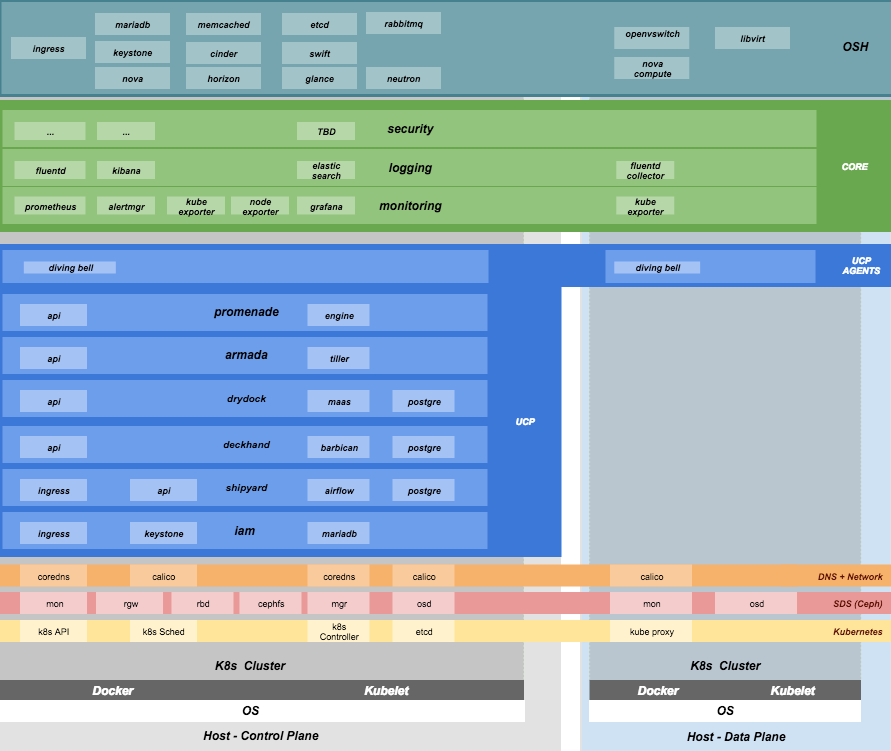

..
      Copyright 2017 AT&T Intellectual Property.
      All Rights Reserved.

      Licensed under the Apache License, Version 2.0 (the "License"); you may
      not use this file except in compliance with the License. You may obtain
      a copy of the License at

          http://www.apache.org/licenses/LICENSE-2.0

      Unless required by applicable law or agreed to in writing, software
      distributed under the License is distributed on an "AS IS" BASIS, WITHOUT
      WARRANTIES OR CONDITIONS OF ANY KIND, either express or implied. See the
      License for the specific language governing permissions and limitations
      under the License.

OOK Deployment
==============

Terminology
-----------

**Cloud**: A platform that provides a standard set of interfaces for `IaaS <https://en.wikipedia.org/wiki/Infrastructure_as_a_service>`_ consumers.

**`UCP <https://github.com/att-comdev>`_**: (UnderCloud Platform) is a broad integration of several components enabling
an automated, resilient Kubernetes-based infrastructure for hosting Helm-deployed
containerized workloads.

**`OSH <https://docs.openstack.org/openstack-helm/latest/>`_**: (OpenStack Helm) is a collection of Helm charts used to deploy OpenStack
on kubernetes.

**Undercloud/Overcloud**: Terms used to distinguish which cloud is deployed on
top of the other. In this implementation, OSH (overcloud) is deployed on top of
UCP (underlcoud).

**OOK**: (OpenStack on Kubernetes) refers to the specific implementation of
OpenStack Helm charts onto UCP kubernetes that is documented in this project.

**Control Plane**: From the point of view of the cloud service provider, the
control plane refers to the set of resources (hardware, network, storage, etc).
sourced to run cloud services.
The reference deployment of OOK does not distinguish between UCP and OSH
control planes, as it assumes the hardware is the same for both.

**Data Plane**: From the point of view of the cloud service provider, the data
plane is the set of resources (hardware, network, storage, etc.) sourced to
to run consumer workloads.
When used in this document, "data plane" refers to the data plane of the
overcloud (OSH).

**Host Profile**: A host profile is a standard way of configuring a bare metal
host. Encompasses items such as the number of bonds, bond slaves, physical
storage mapping and partitioning, and kernel parameters.

Component Overview
^^^^^^^^^^^^^^^^^^

Node overview
^^^^^^^^^^^^^

This document refers to several types of nodes, which vary in their purpose, and
to some degree in their orchestration / setup:

- **Build node**: This refers to the environment where configuration documents are
  built for your environment.
- **Genesis node**: The "genesis" or "seed node" refers to a short-lived node used
  to get a new deployment off the ground, and is the first node built in a new
  deployment environment.
- **Control / Controller nodes**: The nodes that make up the control plane
- **Compute nodes / Worker Nodes**: The nodes that make up the data plane

Support
-------

Bugs may be followed against components as follows:

- General: If you're unsure of the root cause of an issue, you may file it in
  the `Github issues for Treasuremap <https://github.com/att-comdev/treasuremap/issues>`_.
  However, if you know the root issue, then the more expedient path to issue
  resolution is to file bugs against OSH and specific UCP projects as follows:

  - UCP: Bugs may be filed using `github issues <https://github.com/att-comdev>`_ for specific UCP projects
  - OSH: Bugs may be filed against OpenStack Helm in `launchpad <https://bugs.launchpad.net/openstack-helm/>`_.

Pre-req
-------

1. Ensure your environment has access to the artifactory instance where
   UCP and OSH artifacts are published.
2. Establish a location you will use to archive/track your configuration
   documents (e.g., github)

Hardware Prep
-------------

Disk
^^^^

1. Control plane server disks:

   - Two-disk RAID-1 mirror for operating system
   - Remaining disks as JBOD for Ceph. (Ceph journals should preferentially be
     deployed to SSDs where available.)

2. Data plane server disks:

   - Two-disk RAID-1 mirror for operating system
   - Remaining disks need to be configured according to the host profile target
     for each given server (e.g., RAID-6).

BIOS and IPMI
^^^^^^^^^^^^^

1. Virtualization enabled in BIOS
2. IPMI enabled in server BIOS (e.g., IPMI over LAN option enabled)
3. IPMI IPs assigned, and routed to the environment you will deploy into
   Note: Firmware bugs related to IPMI are common. Ensure you are running the
   latest firmware version for your hardware. Otherwise, it is recommended to
   perform an iLo/iDrac reset, as IPMI bugs with long-running firmware are not
   uncommon.
4. Set PXE as first boot device and ensure the correct NIC is selected for PXE

Network
^^^^^^^

1. You have a network you can successfully PXE boot with your network topology
   and bonding settings (dedicated PXE interace on untagged/native VLAN in this
   example)
2. You have (VLAN) segmented, routed networks accessible by all nodes for:

   1. Management network(s) (k8s control channel)
   2. Calico network(s)
   3. Storage network(s)
   4. Overlay network(s)
   5. Public network(s)

HW Sizing and minimum requirements
----------------------------------

+----------+----------+----------+----------+
|  Node    |   disk   |  memory  |   cpu    |
+==========+==========+==========+==========+
|  Build   |   10 GB  |  4 GB    |   1      |
+----------+----------+----------+----------+
| Genesis  |   100 GB |  16 GB   |   8      |
+----------+----------+----------+----------+
| Control  |   10 TB  |  128 GB  |   24     |
+----------+----------+----------+----------+
| Compute  |   N/A*   |  N/A*    |   N/A*   |
+----------+----------+----------+----------+

* Workload driven (determined by host profile)

Establishing build node environment
-----------------------------------

1. On the machine you wish to sue to generate deployment files, install required
   tooling::

    sudo apt -y install docker.io git

2. Clone and link the required git repos as follows::

    git clone https://github.com/att-comdev/pegleg
    git clone https://github.com/att-comdev/treasuremap

Building Site documents
-----------------------

This section goes over how to put together site documents according to your
specific environment, and generate the initial Promenade bundle needed to start
the site deployment.

Preparing deployment documents
^^^^^^^^^^^^^^^^^^^^^^^^^^^^^^

In its current form, pegleg provides an organized structure for YAML elements,
in order to separate common site elements (i.e., ``global`` folder) from unique
site elements (i.e., ``site`` folder).

To gain a full understanding of the pegleg strutcure, it is highly recommended
to read pegleg documentation on this `here <https://pegleg.readthedocs.io/en/latest/artifacts.html/>`_.

Change directory to the pegleg/site folder and copy an existing site to use as a
reference for $NEW_SITE::

    NEW_SITE=mySite
    cd treasuremap/deployment_files
    cp -r site/atl-lab1 site/$NEW_SITE

The follow sections will highligh changes that should be made to each YAML to
correctly configure your environment's deployment.

Generate secrets
^^^^^^^^^^^^^^^^

Generate the passphrases used in your environment as follows::

    (cd secrets_tools && ./gen.sh)

Manually modify the ``data`` key to ``data: password`` for the following
components that do not yet support setting a custom passphrase::

    secrets_tools/ucp_shipyard_postgres_password.yaml
    secrets_tools/ucp_airflow_postgres_password.yaml
    secrets_tools/ucp_armada_keystone_password.yaml

Move the secrets to your $NEW_SITE's location for passphrase secrets::

    mv secrets_tools/*.yaml site/$NEW_SITE/secrets/passphrases

Public SSH keys for environment access are stored under
``site/$NEW_SITE/secrets/publickey/``. Make copies of ``ca846m_ssh_public_key.yaml``
and name the copies according to each ssh key you wish to specify. Delete any
unneeded keys leftover from ``atl-lab1``. Modify the contents of each remaining
file as follows:

- metadata/name: Specify the name of public SSH key
- data: Specify the public SSH key (``ssh-rsa ...``)

site/$NEW_SITE/profiles/region.yaml
^^^^^^^^^^^^^^^^^^^^^^^^^^^^^^^^^

File containing the Drydock region definition for this site. Setting highlights:

- metadata/name: Set to the desired region name (e.g., ``$NEW_SITE``). For current
  deployment purposes, the region name should be set the same as the site name
  in the next section.
- metadata/substitutions: Substitutions for SSH public key passed to Drydock.
  These keys will be deployed to bare metal when it is PXE booted. Define
  substitutions for each SSH key defined in the previous section, e.g.::

    substitutions:
      - dest:
          path: .authorized_keys[0]
        src:
          schema: deckhand/PublicKey/v1
          name: ca846m_ssh_public_key
          path: .
      - dest:
          path: .authorized_keys[1]
        src:
          schema: deckhand/PublicKey/v1
          name: am240k_ssh_public_key
          path: .

  where the number enclosed in square brackets is a zero-indexed iterable, and
  the ``name`` for each matches the names of the SSH keyes defined in the
  publickey secrets from the previous section.

site/$NEW_SITE/site-definition.yaml
^^^^^^^^^^^^^^^^^^^^^^^^^^^^^^^^^

The root level site definition file. Setting highlights:

- data/globals_revision: Set to the desired revision of shared ``global`` and
  ``type`` elements in the site heirarhcy. For example, you would specify ``v1.0``
  to overlay your site data onto elements from ``./pegleg/global/v1.0`` and
  ``./pegleg/type/*/v1.0``.
- data/site_type: Set to the desired site type (e.g., ``cicd``, ``large``, etc)
- metadata/name: Set to the desired site name (e.g., ``$NEW_SITE``)

site/$NEW_SITE/networks/physical/rack06-network.yaml
^^^^^^^^^^^^^^^^^^^^^^^^^^^^^^^^^^^^^^^^^^^^^^^^^^

File containing Drydock definitions of NetworkLink and Network elements.

Begin by reviewing each ``drydock/Network/v1`` element. In this example, the
networks we reference are:

- Rack06 PXE: rack06-pxe
- Rack06 Management: rack06-mgmt
- Rack06 Storage: rack06-storage
- Rack06 Calico: rack06-calico
- Rack06 OpenStack SDN: rack06-ossdn
- Rack06 Contrail: rack06-contrail
- Rack06 Publically routed network: rack06-public

Although we have only one rack of servers in our example, we assume a naming
convention that implies a per-rack broadcast domain to support the possibility
of future rack expansion in this environment.

Create and configure the ``drydock/Network/v1`` elements according to your
environment's network. Setting highlights:

- data/cidr: Populate with the expected CIDR for each logical network.
- data/dhcp_relay/upstream_target: If your environment contains more than one
  broadcast domain for PXE traffic, you should use this parameter to specify the
  IP address of a DHCP relay which will forward DHCP broadcasts between PXE L2
  networks.
- data/routes: Populate with the list of routes for each network. The default
  route should be defined on the management network. Define static routes to
  reach local subnets (routing from rack06 storage to rack07 storage, etc).
- data/ranges: Populate with the allocation ranges for each network.

  - Use ``type: 'static'`` for the IP range you want to allocate from.
  - Define one or more ``type: 'reserved'`` elements to reserve IP ranges to prevent
    address conflicts with other infrastructure. By convention, the first and/or
    last several IP addresses in a subnet are often used for the gateway IP,
    HSRP, VPN, or other network infrastructure.
  - Use ``type: 'dhcp'`` for PXE networks, in addition to the 'static' range.
    Currently Drydock uses default MaaS behavior, which is to PXE boot nodes
    using this dhcp range (for disocvery and commissioning), and then to deploy
    nodes using IPs from the static pool defined. This requires twice the IP
    address space, but facilitates Promenade-driven kubernetes cluster formation
    which currently requires knowing node IP addresses in advance.

- data/dns/domain: The domain which will be configured for PXE booted nodes.
- data/dns/servers: The DNS servers which will be configured for PXE booted
  nodes. You may specify corporate DNS servers here, as long as those servers
  can resolve upstream (internet) FQDNs.

This file should also be populated with a ``drydock/NetworkLink/v1`` definition
for each type of logical interface you plan to use. In this example, there are
three:

- One NetworkLink for the out of band logical interface (IPMI)
- One NetworkLink for PXE logical interface
- One NetworkLink for a single link aggregated bond

(Other environments that leverage LACP fallback would have only two NetworkLink
elements, as PXE would be combined with the bond interface.)

NetworkLinks should be configured according to your environment. Pay special
attention to the aggregation protocol (if using bonding), the interface MTU, and
the allowed_networks. Configure the allowed_networks for each NetworkLink with
the names of the L3 Network elements you want to go over these interfaces.

Also, note that the NetworkLink for the out of band interface has an extra data
label, ``noconfig: 'enabled'`` to indicate that the network will not be created by
Drydock/MaaS, as this network is assumed to already be in place and managed by
existing infrastructure as a prerequisite to site deployment.

site/$NEW_SITE/networks/common-address.yaml
^^^^^^^^^^^^^^^^^^^^^^^^^^^^^^^^^^^^^^^^^

File containing a number of high-level UCP network related parameters. Setting
highlights:

- data/calico/ip_autodetection_method: The genesis node interface that calico
  will use. In practice, this should be the interface that is assigned a routed
  IP address (i.e. on the management network). Specify as ``interface=ens5`` or
  multiple matches with ``interface=bond0.22|ens5``, adjusting according to your
  genesis node interface name(s).
- data/dns/upstream_servers: Upstream DNS servers. You may specify corporate DNS
  servers here, as long as those servers can resolve upstream (internet) FQDNs.
- data/genesis/hostname: Set to the hostname used to provision the genesis node.
- data/genesis/ip: Set to the static IP address which was manually configured
  for the genesis node.
- data/masters: Designate nodes that will run kubernetes master services. You
  should specify the same list of nodes which will run UCP services (control
  plane nodes).
- data/ntp/servers_joined: Upstream NTP servers. You may specify corporate NTP
  servers here if available.
- data/storage/ceph/cluster_cidr: CIDR(s) for Ceph internal traffic. Set this to
  the list of all management networks used in the environment that will host
  Ceph services. In practice, this means the list of the management networks
  assigned to nodes designated to run UCP services (control plane nodes).
- data/storage/ceph/public_cidr: Set the same as above.

site/$NEW_SITE/profiles/hardware/hw_generic.yaml
^^^^^^^^^^^^^^^^^^^^^^^^^^^^^^^^^^^^^^^^^^^^^^

File containg the generic HardwareProfile for this site.

In the future, this file will track hardware detail such as the hardware
manufacturer, firmware versions, and PCI IDs for NICs. Currently these values
are not used, but some dummy values need to be present. Use this file as-is.

site/$NEW_SITE/profiles/host/
^^^^^^^^^^^^^^^^^^^^^^^^^^^

This directory contains a list of files that define ``drydock/HostProfile/v1``
elements. This example demonstrates layering of host profiles, as it defines a
``base_control_plane`` profile, which is inherited by another profile,
``rack6_control_plane``. Another host profile, ``base_data_plane`` is inherited by
``rack6_data_plane``.

This example demonstrates a typical use-case where data-plane nodes may have a
different bond configuration than control-plane nodes. If we added another rack
with its own CIDRs, we could inherit the same base host profiles to avoid
unnecessary duplication of information.

site/$NEW_SITE/profiles/host/base_control_plane.yaml
^^^^^^^^^^^^^^^^^^^^^^^^^^^^^^^^^^^^^^^^^^^^^^^^^^

An example host profile that defines a desired bonding configuration for control
plane nodes.

site/$NEW_SITE/profiles/host/rack6_control_plane.yaml
^^^^^^^^^^^^^^^^^^^^^^^^^^^^^^^^^^^^^^^^^^^^^^^^^^^

An exapmle host profile that defines a desired bonding configuration for data-
plane nodes.

site/$NEW_SITE/baremetal/rack6.yaml
^^^^^^^^^^^^^^^^^^^^^^^^^^^^^^^^^

File containing the ``drydock/BareMetalNode/v1`` resources for this site.

Populate with a BareMetalNode element for each bare metal node in the
environment. Setting highlights:

- metadata/name: Set to the desired hostname of the node
- data/host_profile: Set the host profile that will be applied to the node
- data/metadata/rack: Set the node's rack number / ID here
- data/metadata/tags: Tag with ``'masters'`` to designate nodes which will run the
  kubernetes master services, and with ``'workers'`` to designate nodes which will
  be kubernetes workers.
- data/addressing: Manually set unqiue IP network address for each node, using
  IPs within the static ranges specified for the same networks in
  ``rack06-network.yaml``.

site/$NEW_SITE/pki/kubernetes-nodes.yaml
^^^^^^^^^^^^^^^^^^^^^^^^^^^^^^^^^^^^^^

File containing management IPs and hostnames of nodes. Each node in the
environment will require its own ``promenade/KubernetesNode/v1`` element. Setting
highlights:

- data/hostname: Hostname of the node that is used to generate certificates.
  Ensure this matches what has been specified in ``rack06-baremetal.yaml`` for
  each node. In addition, there needs to be an entry for the ``genesis`` node.
- metadata/name: Repeat the hostname of the node here.
- data/ip: Use the IP defined for the management network of the node specified
  in ``rack06-baremetal.yaml``, and in ``common-address.yaml`` in the case of the
  ``genesis`` node. Ensure IPs are correct for their hostnames.

Generating site YAML files
^^^^^^^^^^^^^^^^^^^^^^^^^^

After constituent YAML configurations are finalized, use pegleg to perform the
merge that will yield the combined global + site type + site YAML::

    mkdir ~/$NEW_SITE_yaml
    sudo tools/pegleg.sh site collect $NEW_SITE > ~/${NEW_SITE}_yaml/$NEW_SITE.yaml

Building the Promenade bundle
^^^^^^^^^^^^^^^^^^^^^^^^^^^^^

Checkout promenade and run the ``simple-deployment.sh`` script::

    cd ~
    mkdir ~/${NEW_SITE}_bundle
    git clone https://github.com/att-comdev/promenade.git
    sudo promenade/tools/simple-deployment.sh ~/${NEW_SITE}_yaml ~/${NEW_SITE}_bundle

Estimated runtime: About **1 minute** plus **20 seconds per node** defined in
``joining-host-config.yaml``.

Genesis node
------------

Initial setup
^^^^^^^^^^^^^

Start with a manual install of Ubuntu 16.04 on the node you wish to use to seed
the rest of your environment. Ensure the host has outbound internet access and
can resolve public DNS entries.

Ensure that the hostname matches the hostname specified in the Genesis.yaml file
used in the previously generated configuration. If it does not, then either
change the hostname of the node to match the configuration documents, or re-
generate the configuration with the correct hostname.

Install ntpdate/ntp
^^^^^^^^^^^^^^^^^^^

Check if ntp is already installed/running::

    ntpq -p

If this prodcues an output, ensure that the ``offset`` field is less than 50.000
(miliseconds) for the primary time source (indicated by ``*`` at the line start)::

    .    remote           refid      st t when poll reach   delay   offset  jitter
    ==============================================================================
    +time.tritn.com  63.145.169.3     2 u   48   64  377   54.875    3.533   2.392
    +mis.wci.com     216.218.254.202  2 u   53   64  377   73.954   -2.089   2.538
    *97-127-86-125.m .PPS.            1 u   43   64  377   24.638    0.122   2.686

Otherwise, install and run ntpdate prior to installing ntp::

    type ntpd && sudo service ntp stop && RESTART=true
    sudo apt -y install ntpdate
    sudo ntpdate ntp.ubuntu.com
    sudo apt -y install ntp
    [ -n $RESTART ] && sudo service ntp restart

and verify the node begins to sync to upstream NTP sources, indicated by non-zero
``reach`` value for the primary time source (indicated by ``*`` at the line
start).

Promenade bootstrap
^^^^^^^^^^^^^^^^^^^

Copy the ``genesis.sh`` script generated in the ``promenade/build`` directory
on the build node to the genesis node. Then, run the script as sudo on the
genesis node::

    sudo ./genesis.sh

Estimated runtime: **40m**

In the event of failures, refer to `genesis troubleshooting <https://promenade.readthedocs.io/en/latest/troubleshooting/genesis.html>`_.

Following completion, run the ``validate-genesis.sh`` script to ensure correct
provisioning of the genesis node::

    sudo ./validate-genesis.sh

Estimated runtime: **2m**

Nginx server workaround (no longer needed??)
^^^^^^^^^^^^^^^^^^^^^^^^^^^^^^^^^^^^^^^^^^^^

Currently it is necessary to setup a web server to host the other Promenade
bundle build artifacts, so that new nodes PXE booted into the environment can
retrieve their ``join-<NODE>.sh`` scripts and run them, without a manual
execution. (This script will join the node to the UCP kubernetes cluster.)

At present, you may use the genesis node for this purpose (and defer genesis
teardown until some later time when this workaround is no longer necessary).

Copy all of the Promenade build artifacts to the genesis node, then run the
following after substituting local disk path to the promenade artifacts that
were copioed onto the genesis node::

    sudo docker run -d -v $PATH_TO_PROMENADE_BUNDLE:/usr/share/nginx/html -p 6880:80 nginx

Estimated runtime: **5s**

Deploy Site with Shipyard
^^^^^^^^^^^^^^^^^^^^^^^^^

Start by cloning the shipyard repository to the Genesis node::

    git clone https://review.gerrithub.io/att-comdev/shipyard

Next, run the deckhand_load_yaml.sh script as follows::

    sudo ./shipyard/tools/deckhand_load_yaml.sh $REGION $PATH_TO_ALL_YAMLS

where REGION is the region name (as defined in drydock.yaml), and PATH_TO_ALL_YAMLS
is the path to a directory containing all YAML files generated in previous
sections.

Estimated runtime: **3m**

Troubleshooting placeholder

Now deploy the site with shipyard::

    sudo ./shipyard/tools/deploy_site.sh

Estimated runtime: **1h30m**

Troubleshooting placeholder

The message ``Site Successfully Deployed`` is the expected output at the end of a
successful deployment.

